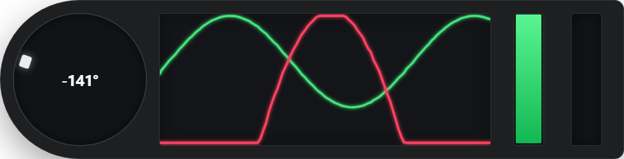

# F1 25 Pedal Overlay

A compact, transparent Windows overlay for **EA SPORTS F1 25**. It displays solid throttle and brake bars alongside a scrolling five-second input graph.

An optional steering gauge can be shown to the graph's left. The game reports steering as a normalized value, so the gauge maps full lock to `-180°` and `180°`.



## Beginner installation guide for Windows

No coding knowledge is required. This project currently runs from its folder instead of using a traditional installer. The first setup usually takes a few minutes; after that, starting it only takes one command.

### 1. Download and extract the overlay

1. On this GitHub page, select the green **Code** button.
2. Select **Download ZIP**.
3. Open your **Downloads** folder in File Explorer.
4. Right-click the downloaded ZIP file and select **Extract All...**.
5. Select **Extract** and then open the extracted folder.

You are in the correct folder when you can see a file named `package.json`. If you only see another folder, open that folder too.

### 2. Install Node.js

Node.js is the program Windows uses to build and run the overlay.

1. Open the official [Node.js download page](https://nodejs.org/).
2. Download the **LTS** version. Version 20 or newer is required.
3. Open the downloaded installer.
4. Keep the default options, select **Next** until **Install** appears, and then select **Install**.
5. Close any Command Prompt windows that were already open after installation.

### 3. Open a terminal in the overlay folder

The easiest method is:

1. Open the extracted overlay folder in File Explorer—the folder containing `package.json`.
2. Select the address bar at the top of File Explorer.
3. Type `cmd` and press **Enter**.

A black Command Prompt window opens directly in the correct folder. This is the terminal. Do not worry if your folder path looks different from someone else's.

Useful navigation commands:

- `dir` shows the files and folders in your current location.
- `cd "Folder Name"` enters a folder. Quotation marks are needed when its name contains spaces.
- `cd ..` moves back one folder.
- `cd /d "C:\full\path\to\folder"` jumps directly to a folder, even when it is on another drive.

For example, a project extracted into Downloads may be opened with:

```bat
cd /d "%USERPROFILE%\Downloads\f1-25-pedal-overlay-main"
```

Run `dir` after navigating. If `package.json` appears in the list, you are in the correct place.

### 4. Install the overlay files

In the Command Prompt window, type this command and press **Enter**:

```bat
npm install
```

Wait until the command finishes and a new line containing your folder path appears. This downloads the files the overlay needs. You normally only need to run `npm install` once, or again after downloading a newer version of the project.

### 5. Configure telemetry in F1 25

Open **Settings → Telemetry Settings** in F1 25 and use:

- UDP Telemetry: **On**
- UDP Broadcast Mode: **Off** when the game and overlay are on the same PC
- UDP IP Address: **127.0.0.1**
- UDP Port: **20777**
- UDP Send Rate: **60 Hz**
- UDP Format: **2025**

Use borderless or windowed gameplay for reliable always-on-top behavior. True exclusive fullscreen can hide desktop overlays.

### 6. Start the overlay

To start with only the graph and pedal bars, run:

```bat
npm start
```

To start with the steering gauge already visible, run:

```bat
npm run steering
```

Keep the Command Prompt window open while using the overlay. If Windows asks for network access, allow it on **Private networks**. Press `Ctrl+Shift+Q` to close the overlay and return to the terminal.

### 7. Start it again later

You do not need to reinstall anything. Open the project folder, type `cmd` in the File Explorer address bar, and run `npm start` or `npm run steering` again.

### Simple troubleshooting

- **`npm` is not recognized:** Restart Command Prompt. If it still fails, reinstall the Node.js LTS version and keep the installer's default options.
- **The terminal cannot find `package.json`:** You are in the wrong folder. Run `dir`, then use `cd "Folder Name"` until `package.json` is listed.
- **The command looks stuck:** This is normal while the overlay is running. Use `Ctrl+Shift+Q` to close it.
- **The overlay is visible but the bars do not move:** Check every F1 25 telemetry setting above. Press `Ctrl+Shift+D` to confirm the overlay itself works with its demo signal.
- **The overlay disappears behind the game:** Change F1 25 from exclusive fullscreen to borderless mode.

## Port conflicts

Only one application can receive a loopback UDP port reliably on Windows. If port `20777` is already in use, close the other telemetry application or launch this overlay on another port and enter the same port in F1 25:

```bat
set F1_UDP_PORT=20778
npm start
```

## Controls

- Drag anywhere on the overlay to position it while it is unlocked.
- `Ctrl+Shift+O` toggles lock/edit mode.
- `Ctrl+Shift+H` hides or shows the overlay.
- `Ctrl+Shift+D` toggles the built-in demo signal.
- `Ctrl+Shift+S` toggles the steering gauge.
- `Ctrl+Shift+Q` closes the overlay.

## Development

```powershell
npm test
```

The UDP parser is isolated in `src/telemetry/parser.ts`. It accepts the official F1 25 packet format (`2025`), packet ID `6`, and reads the player car selected by the packet header.
